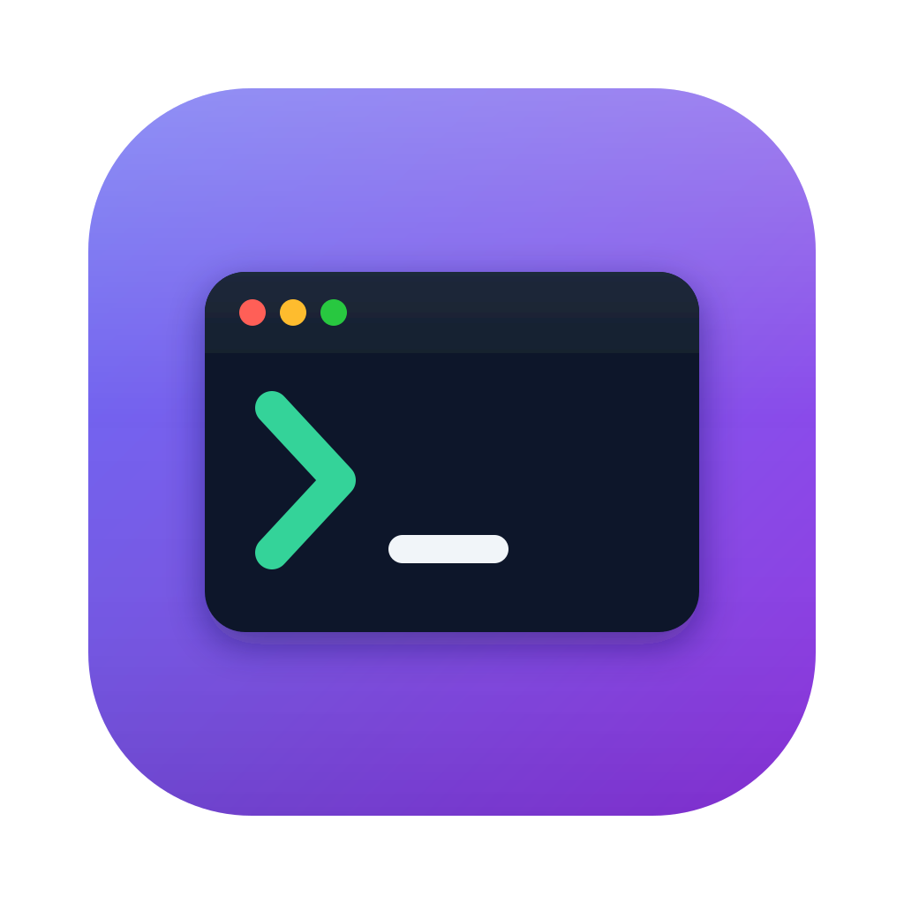

# Go2ShellNext

**Open your terminal from the macOS Finder toolbar — at the folder you're looking at.**

Go2ShellNext is a native Swift rewrite of the classic [Go2Shell](https://github.com/QuentinGib/Go2Shell) utility, modernized for Apple Silicon and recent macOS. The whole app weighs in at **~700 KB** with no bundled runtime — it uses the system frameworks only.



## Features

- **Toolbar button** — hold <kbd>⌘</kbd> and drag `Go2ShellNext.app` onto the Finder toolbar; click it to open a terminal at the front Finder window's folder
- **Right-click menu** — right-click any folder in Finder and choose *Open Shell Here* to open it directly
- **Multiple terminals** — Terminal.app, iTerm2, Warp, Ghostty, WezTerm, Kitty, Alacritty
- **Custom command** — optionally run a command (e.g. `vim .`) after `cd`
- **Open in new tab** — reuse the front terminal window via a new tab when supported
- **Tiny & native** — pure Swift + AppKit/SwiftUI, no Electron, no WebView runtime, ~700 KB

## Usage

| Action | Result |
|---|---|
| Click the toolbar button / double-click the app | Terminal opens at the front Finder window's folder |
| Hold <kbd>⌥</kbd> while launching the app | Opens the settings window |
| Right-click in Finder → *Open Shell Here* | Terminal opens at that folder |
| Right-click in Finder → *Settings…* | Opens the settings window |
| Right-click in Finder → *Quit Go2ShellNext* | Quits the background app |

## Install

1. Download `Go2ShellNext.app.zip` from the [latest release](https://github.com/neekin/go2shellNext/releases/latest), unzip and move the app to `/Applications`.
2. The app is ad-hoc signed, so remove the Gatekeeper quarantine first:

   ```bash
   xattr -cr /Applications/Go2ShellNext.app
   ```

3. Launch it once, then enable the Finder extension:
   **System Settings → General → Login Items & Extensions → Extensions → File Providers → Go2ShellNext**
4. Hold <kbd>⌘</kbd> and drag `Go2ShellNext.app` from `/Applications` onto the Finder toolbar.

## Build from source

```bash
./build.sh          # compiles the FinderSync extension + app, assembles and signs Go2ShellNext.app
```

Requires macOS 12+ on Apple Silicon and Xcode command line tools (`swiftc`). No Node/Rust toolchains needed.

## Project layout

```
swift/App/        Main application (AppKit + SwiftUI)
extensions/       FinderSync extension (appex)
assets/           Icon sources
legacy/           Archived Tauri prototype (no longer built)
build.sh          One-shot build script
```

## Communication design (for the curious)

The sandboxed FinderSync extension and the main app talk via a small JSON request file (app-group container, with the extension's own container as fallback) plus a Darwin notification when the app is already running — or launch arguments (`--open-dir=…`, `--settings`) when it isn't. A fresh-request TTL prevents stale requests from hijacking a normal launch. See `swift/App/FinderBridge.swift`.
